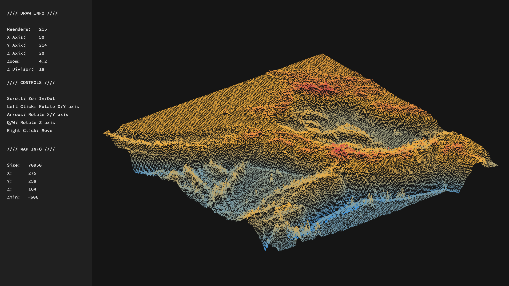

# 42-FdF

## Overview

The 42-FdF project is part of the 42 school's curriculum, focusing on graphics programming. The objective is to develop a program that reads a file containing a grid of height values and generates a 3D wireframe representation of the corresponding landscape. This project enhances understanding of 3D projections, transformations, and the use of graphics libraries in C.

## Screenshot



## Features

- **3D Wireframe Rendering**: Generates a 3D wireframe model from a 2D grid of height values.
- **Isometric Projection**: Displays the 3D model using isometric projection for better visualization.
- **User Interaction**: Allows users to interact with the model through keyboard inputs, enabling rotation, zoom, and translation.
- **Color Gradients**: Applies color gradients based on height values to enhance visual representation.

## Installation

1. **Clone the Repository**:
   ```bash
   git clone https://github.com/jdecorte-be/42-FdF.git
   cd 42-FdF
   ```

2. **Compile the Program**:
   ```bash
   make
   ```

   This will compile the source code and generate the `fdf` executable.

## Usage

To run the program, use the following command:

```bash
./fdf [path_to_map_file]
```

Replace `[path_to_map_file]` with the path to a valid `.fdf` file containing the grid of height values.

**Controls**:

- **Rotation**: Use the arrow keys to rotate the model along the X and Y axes.
- **Zoom**: Press `+` to zoom in and `-` to zoom out.
- **Translation**: Use `W`, `A`, `S`, `D` keys to move the model up, left, down, and right, respectively.
- **Z-axis Scaling**: Adjust the elevation scale using `Page Up` and `Page Down` keys.

## Dependencies

The project relies on the MiniLibX library for graphics rendering. Ensure that the `minilibx_macos` directory is present and properly configured. The project also includes a custom `libft` for various utility functions.

## Project Structure

- **src/**: Contains the main source code files for the project.
- **src_bonus/**: Includes additional features and enhancements.
- **libft/**: Custom library with utility functions.
- **minilibx_macos/**: MiniLibX library for macOS.
- **Makefile**: Build configuration file.


